## Arithmetic Logic Unit (ALU)
The 8-Bit ALU supports computing the following arithmetic and logic operations:
- Add, Subtract
- Logic AND, OR, XOR, NOT
- Shift Left (SHL)
- Shift Logic Right (SLR)
- Shift Arithmetic Right (SAR)
- Rotate Right (ROR)

This makes a total of 10 different operations, which I consider to be rather many for a small breadboard-computer like this one.  
This brings me to the question: How do you implement all of these in hardware? Basically, there are two extremes:
1. Use dedicated gates for every operation and use a big multiplexer to select the result
2. Use a pre-made ALU-chip (like the 74181), which includes all the necessary operations you could ever dream of, except shifts (if you want to see a build with this approach, I highly recommend to check out [this project by rolf-electronics](https://github.com/rolf-electronics/The-8-bit-SAP-3))

But as always, there's something in between: I didn't want to go with option 1 because it would use an extremely large amount of space relative to the rest of the computer. The IC-count would also increase by using this approach.  
But I didn't want to use a single chip for the ALU either, as this is primarily a learning project for me. I want to have fun building and explore different options for the same solution. In the end, I settled on the following approach with this structure:
 

As you can see, my ALU-design has two sections: An adder for addition and subtraction, and two EEPROM's, which handle all the logic operations.  
### Adding/Subtracting
The eight input bits from the A-Register are directly connected to the A-input of the adder (which is build from two 74283 chips). In contrast, each of the TMP-Register bits first goes through an XOR-gate, which allows the ALU to switch between addition (ALU_AOP = 0) and subtraction (ALU_AOP = 1). If you want to learn more about how you can perform a subtraction with an adder, the carry in of the adder and XOR-gates, you can check out [this article](https://graphicmaths.com/computer-science/logic/subtractor/), which explains the topic with helpful images.
 
Take a look at the [schematics](https://github.com/CodingFactoryT/8-Bit-Breadboard-Computer/blob/main/Schematics/ALU.pdf): you may recognize that the ALU_AOP and the ALU_CIN are two independent control/input bits. If you only needed to compute simple 8-Bit addition and subtraction, you could connect them together, but with my approach, you can also add instructions like "Add with Carry" or "Subtract with Carry". This comes in handy when you want to add numbers that are represented by 16-bits or more, as you can just send the carry from the previous byte to the addition for the next byte. An example for this is incrementing or decrementing the Stack-Pointer, which is 16-bits long.

### Logic Computations
The main components of the second section are two 28C16 EEPROMs. These help in reducing space on the breadboard by storing all the combinations of operation selection and input bits. If you take a look at the datasheet for these chips or the [schematics](https://github.com/CodingFactoryT/8-Bit-Breadboard-Computer/blob/main/Schematics/ALU.pdf) of the ALU, you may recognize that each chip only has 11 address-lines (which act as the inputs for the EEPROMs). But in reality, we would need 19 input pins: 3 for the operation selection (which makes a total of 2^3 = 8 different logic operations), 8 for the A-Register and 8 for the TMP-Register.  
The solution is to split up the upper and lower bits of each register: EEPROM 1 handles the upper 4 bits, EEPROM 2 the lower 4 bits. That way, we can perform a logic operation like "AND" separately on two EEPROMs and combine their outputs to get an 8-bit result.  
This approach works fine for the AND, OR, XOR and NOT operations. But while computing shifts, the upper and lower four bits aren't independent of each other anymore, as a bit from the lower nibble may get shifted into the upper nibble or vice versa. But all the instructions that have this problem are unary instructions, which means they only have a single operand and thus can be computed by a single EEPROM.  
That's why I introduced a few multiplexers which do the following job: If ALU_BOP[2] is 0 (which means that the instruction is either AND, OR, XOR or NOT), compute the upper and lower result-nibble independently by splitting the inputs across both multiplexers. After the computation, the resulting two nibbles are combined into a single 8-Bit result.  
But if ALU_BOP[2] is 1, the ALU is asked to compute a shift, so it only uses EEPROM 1 for the complete computation with the full 8 input-bits from the A-Register.  
 

Based on ALU_SRC, another 8-bit multiplexer (which is made of two 74157 chips) selects the requested operation: If ALU_SRC is 0, the result from the adders is used, if it's 1, it's the result from the logic section of the ALU.

### Flags
Flags are very important. Without them, conditional jumps wouldn't be possible. That's why I included the four most common flags in my design:
- Zero Flag (ZF): Is set if the result is zero
- Negative Flag (NF): Is set if the result is negative, which means that the msb of the result is 1
- Carry Flag (CF): Is set if the addition or subtraction resulted in a carry-out from the adders. That's the case if the result of an unsigned addition or subtraction doesn't fit into the eight result bits. It is also used for adding or subtracting numbers that are larger than a single byte  
- Overflow Flag (VF): Is set if the result of a signed addition or subtraction doesn't fit into the eight result bits

The negative and the carry flag are directly connected to the ALU and don't require any special computation.
 
The zero flag is set when all result bits are zero, which can be expressed with the following formula:  

 
ZF = 
R0 &middot; 
R1 &middot; 
R2 &middot; 
R3 &middot; 
R4 &middot; 
R5 &middot; 
R6 &middot; 
R7  
= 
(R0 + R1) &middot;
(R2 + R3) &middot;
(R4 + R5) &middot;
(R6 + R7)
 
   

So we can compute the Zero-Flag with four 2-Input NOR- and three 2-Input AND-gates.
 
 
The overflow flag is always set if the sign of the A-Register and the TMP-Register* is the same, but differs from the sign of the result.
I realized that logic by using a 3-to-8 Multiplexer as a lookup table, this allowed me to implement the logic in a single gate. 

*: We also want the overflow flag to be valid for subtraction, so the msb of the A-Register is actually compared with the output of the XOR between the msb of the TMP-Register and ALU_SRC. 
